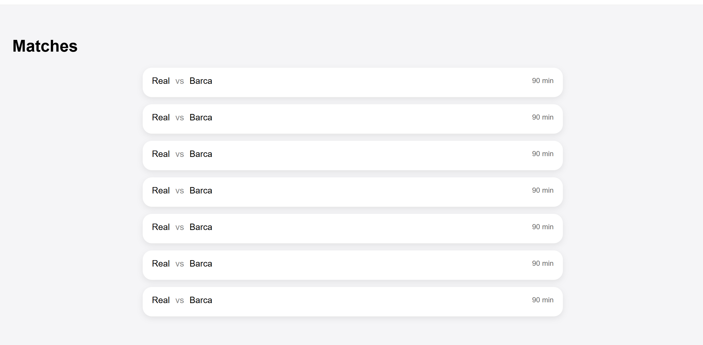
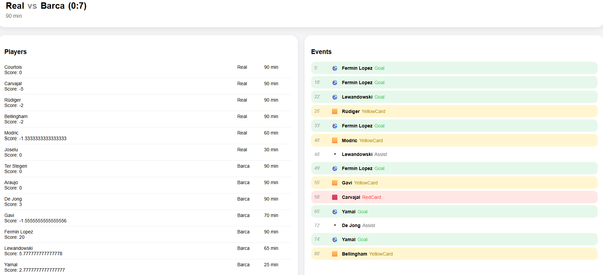
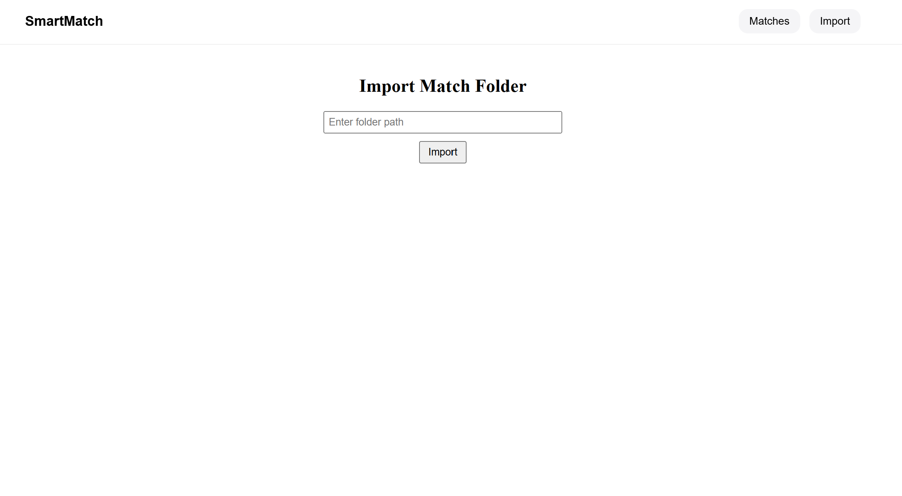

# Smart Match Analytics – Aufgabenstellung

---

## 1. Ziel der Übung

Ziel dieser Übung ist es, eine bestehende Drei-Schichten-Architektur  
(SQLite, Entity Framework Core, ASP.NET Core Minimal API, Angular)  
zu erweitern und zu vertiefen.

Die Studierenden sollen:

- fachliche Anforderungen verstehen und umsetzen
- nicht-triviale Geschäftslogik implementieren
- strukturierte Importdaten validieren und verarbeiten
- Web APIs erweitern
- UI-Logik im Frontend umsetzen
- sinnvolle C#-Unit-Tests schreiben

---

## 2. Überblick über die Domäne

Die Anwendung analysiert Fußballspiele.

Ein Spiel besteht aus:

- zwei Mannschaften
- mehreren Spielern
- einer festen Matchdauer
- einer Menge von Spielereignissen (Tore, Karten, Wechsel)

Aus diesen Daten werden Leistungskennzahlen für Spieler berechnet.

---

## 3. Begriffe und Definitionen

**Match**  
Ein einzelnes Spiel zwischen zwei Mannschaften.

**Mannschaft**  
Ein Team, das an einem Match teilnimmt.

**Spieler**  
Eine Person, die für eine Mannschaft spielt.

**Match Event**  
Ein zeitlich zugeordnetes Ereignis innerhalb eines Matches.

**Gespielte Minuten**  
Die effektive Spielzeit eines Spielers in einem Match.

**Impact Score**  
Eine berechnete Kennzahl zur Bewertung der Spielerleistung.

---

## 4. Funktionale Anforderungen – Überblick

Das System muss:

- Matchdaten aus Dateien importieren
- Spieleraufstellungen und Events verarbeiten
- Leistungskennzahlen berechnen
- Analyseergebnisse über eine Web API bereitstellen
- Analyseergebnisse im Angular-Frontend anzeigen
- Geschäftslogik automatisiert testen

---

## 5. Zentrale Geschäftslogik

Die zentrale Geschäftslogik ist die **Berechnung des Impact Scores**.

Der Impact Score basiert auf:

- positiven Aktionen (Goal, Assist)
- negativen Aktionen (YellowCard, RedCard)
- der gespielten Zeit eines Spielers

Die Logik erfordert:

- Aggregation mehrerer Events
- Gewichtung verschiedener Aktionen
- Behandlung von Sonderfällen

---

## 6. Sonderfälle und Randbedingungen

Zu berücksichtigen sind u. a.:

- Spieler mit 0 gespielten Minuten
- Events außerhalb der Matchdauer
- Events nach einer Red Card sind Fehler
- doppelte Events
- fehlerhafte oder unvollständige Importdaten

---

## 7. Datenimport – Überblick

Alle Matchdaten befinden sich in einem gemeinsamen Überordner.

Beispielstruktur:

    AllMatches/
    ├── Real-Barca/
    │   ├── Aufstellung.txt
    │   └── Infos.txt
    ├── Bayern-Dortmund/
    │   ├── Aufstellung.txt
    │   └── Infos.txt

Jeder Unterordner entspricht genau einem Match.

Der Ordnername hat das Format:

    Heimmannschaft-Auswärtsmannschaft

---

## 8. Datei: Aufstellung.txt

### Zweck

Die Datei enthält allgemeine Matchinformationen sowie die Spieleraufstellung.

### Format

    MATCH_DURATION=Spielminuten
    Mannschaft|Spieler|Gespielte Minuten

### Beispiel

    MATCH_DURATION=90
    Real|Bellingham|90
    Real|Modric|30
    Barca|Pedri|90

### Validierungsregeln

- MATCH_DURATION muss größer als 0 sein
- Gespielte Minuten dürfen nicht größer als MATCH_DURATION sein
- Jeder Spieler darf pro Match nur einmal vorkommen
- Spieler mit 0 Minuten sind erlaubt
- Fehlt die Datei, darf das Match nicht importiert werden

---

## 9. Datei: Infos.txt

### Zweck

Die Datei enthält alle Spielereignisse eines Matches.

### Format

    Mannschaft|Spieler|Minute|Aktion

### Beispiel

    Real|Bellingham|6|YellowCard
    Barca|Pedri|15|Goal

---

## 10. Unterstützte Aktionen

    Goal
    Assist
    YellowCard
    RedCard
    SubstitutionIn
    SubstitutionOut

---

## 11. Validierungsregeln für Events

- Mannschaft muss gültig sein
- Spieler muss existieren
- Minute muss innerhalb der Matchdauer liegen
- Aktion muss unterstützt sein
- Nach RedCard keine weiteren Events erlaubt
- Nach SubstitutionOut keine Aktionen erlaubt
- Vor SubstitutionIn keine Aktionen erlaubt

---

## 12. Besondere Logik

- SubstitutionIn / Out beeinflussen nicht die Aufstellungsminuten
- Events von Spielern mit 0 Minuten werden nicht bewertet

---

## Impact Score Berechnung

Die Spielerbewertung beginnt mit einem **Standardwert von 6**. Dieser Wert entspricht einer neutralen, soliden Leistung ohne besondere Spielereignisse. Maximaler Wert = 10. Minimaler Wert = 1.

Danach werden individuelle Aktionen des Spielers berücksichtigt:

### Positive Ereignisse

- **Tor (Goal):** +2 Punkte  
  Tore haben den größten Einfluss, da sie direkt zum Spielerfolg beitragen.

- **Assist:** +1 Punkt  
  Vorlagen sind wertvoll, aber etwas geringer gewichtet als Tore.

Erreicht ein Spieler **3 oder mehr Torbeteiligungen** (Tore + Assists), wird der Score sofort auf das Maximum von **10** gesetzt. Dies repräsentiert eine außergewöhnliche Leistung.

---

### Negative Ereignisse

- **Gelbe Karte (YellowCard):** −1 Punkt  
  Leichter Abzug für Regelverstöße oder unsauberes Spiel.

- **Rote Karte (RedCard):** −3 Punkte  
  Starker Abzug, da der Spieler dem Team erheblich schadet.

---

### Anpassung an die Einsatzzeit

Die Bewertung wird anschließend anhand der tatsächlichen Spielzeit skaliert:

```csharp
double playFactor = (double)player.PlayedMinutes / match.MatchDuration;
score = (int)Math.Round(6 + (score - 6) * playFactor);
```

---


## 13. Web API – Anforderungen

Die API muss unterstützen:

- Abrufen aller Matches
- Abrufen der Match-Details
- Abrufen der Match-Details inklusive Scores

Die API ist die einzige Datenquelle des Frontends.

---

## 14. Angular UI – Anforderungen

Das Frontend muss:

- importierte Matches anzeigen
- Match-Details anzeigen
- Spielerstatistiken darstellen
- Events übersichtlich visualisieren

Mindestens eine Komponente muss nicht-triviale UI-Logik enthalten.

---

## Frontend – Umsetzung (Screenshots)

Die folgenden Screenshots zeigen die implementierte Benutzeroberfläche.

**Abbildung 1 – Matchübersicht**  


**Abbildung 2 – Matchdetails**  


**Abbildung 3 – Eventdarstellung**  


Optional empfehlenswert:

- Score-Anzeige
- Impact-Score Darstellung
- Fehlerfälle / Validierung

---

## 15. Automatisierte Tests

Zusätzlich erforderlich:

- Tests für Impact-Score-Berechnung
- Tests für RedCard-Logik
- Tests für Event-Validierung
- Tests für Import-Logik

Nur C#-Unit-Tests.

---

## 16. Technische Einschränkungen

- Datenmodell darf nicht verändert werden
- DbContext darf nicht angepasst werden
- Frontend nutzt ausschließlich die Web API

---

## 17. Bewertungskriterien

- Korrektheit der Geschäftslogik
- Vollständigkeit der Importlogik
- Saubere Fehlerbehandlung
- Code-Struktur und Lesbarkeit
- Qualität der Tests
- Verständlichkeit der UI
